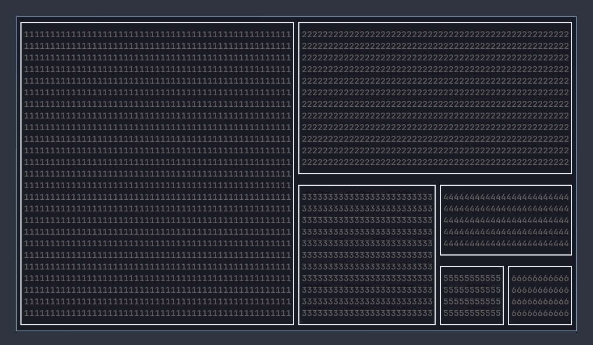

# ccanvas-layout

Component layout manager for ccanvas.



Inspired by Linux window managers.

## What can it do

- Easy positioning of areas.
- Allocated non-overlapping areas on screen for each component to render to.
- Allow a component to be used as an individual component, or a component within a layout with 0 code changes required.

### How does it work

A layout is defined as so:

```rs
pub enum Layout {
    Single(Discriminator),
    SplitVertical(Layout, Layout),
    SplitVertical(Layout, Layout)
}
```

Each split is given a **constraint**, which determines the width/height of the area.

A constraint is defined as so:

```rs
pub struct Constraint {
    base: ConstraintVariant,
    offset_pos: Option<Constraint>,
    offset_neg: Option<Constraint>
}

pub enum ConstraintVariant {
    Max { value: u32 },
    Min { value: u32 },
    Length { value: u32 },
    Percentage { value: u32 },
}
```

The width/heigh the constraint will take can be evaluated by `base + offset_pos - offset_neg`.

For example, `{ base: 50%, offset_neg: 5px }` creates an item that centres on screen. 
```
|<------------------- 100% ------------------->|
|<-- 50% - 5px -->|<- 10px ->|<-- 50% - 5px -->|
```

As for how it makes the components only render in their own respective area, check the explanation in [`libccanvas/layout`](https://github.com/ccanvas/libccanvas/tree/master/src/features/layout).

## Usage

Make sure the feature `layout` is enabled for `libccanvas`.

Use `client.spawn_layouted()` to load a component to be used in a layout, otherwise, use `client.spawn().`

`client.spawn_layouted()` will have no effect on components without `layout` support, read [`libccanvas/layout`](https://github.com/ccanvas/libccanvas/tree/master/src/features/layout) for more info.

```rs
let (layout_discrim, solid1, solid2, solid3, _) = tokio::join!(
    // spawn in ccanvas-layout
    client.spawn("layout".to_string(), "ccanvas-layout".to_string(), Vec::new()),

    // spawn in components that supports ccanvas-layout
    // for this we will be using the minimal ccanvs-solid
    // you'll need to install it from https://github.com/ccanvas/ccanvas-solid
    client.spawn_with_env_layouted("solid".to_string(), "ccanvas-solid".to_string(), Vec::new(), BTreeMap::from([("CHAR".to_string(), "1".to_string())])),
    client.spawn_with_env_layouted("solid".to_string(), "ccanvas-solid".to_string(), Vec::new(), BTreeMap::from([("CHAR".to_string(), "2".to_string())])),
    client.spawn_with_env_layouted("solid".to_string(), "ccanvas-solid".to_string(), Vec::new(), BTreeMap::from([("CHAR".to_string(), "3".to_string())])),

    // subscribe to the layout-ready message
    // when layout is loaded, it will broadcast a ready message
    // we cannot interact with it until we know it is properly loaded
    client.subscribe(Subscription::specific_message_tag("!layout-ready".to_string())),
);

// turn the ResponseContent into Discriminator of the spawned components
let layout_discrim = layout_discrim.into_spawned().unwrap();
let solid1 = solid1.into_spawned().unwrap();
let solid2 = solid2.into_spawned().unwrap();
let solid3 = solid3.into_spawned().unwrap();

// the LayoutComponent struct contains useful functions
// for interacting with ccanvas-layout
let layout = client.layout(layout_discrim.clone());

// we then continuously wait for the ready message
// we only continue after recieving the ready message
loop {
    let event = client.recv().await;

    if let EventVariant::Message { sender, tag, .. } = event.get() {
        // there, layout is ready, we can break out of the loop
        if tag == "!layout-ready" && sender == &layout_discrim {
            break;
        }
    }
}

// create a new layout with solid1 as its component
// also give it some white borders because it looks nice
// the path of solid1 is [] (root)
let mut new_layout = Layout::single(Some(solid1), Some(Border::new(Colour::White, BorderType::Normal)));

// add a new bordered component to the right of [] (solid1)
new_layout.add_bordered_component_right(
    &[],
    Constraint::new(ConstraintVariant::percentage(50), None, None),
    Constraint::new(ConstraintVariant::percentage(50), None, None),
    solid2,
    Border::new(Colour::White, BorderType::Normal),
);

// add a new bordered component to the right of [Right] (solid2)
new_layout.add_bordered_component_below(
    &[Direction::Right],
    Constraint::new(ConstraintVariant::percentage(50), None, None),
    Constraint::new(ConstraintVariant::percentage(50), None, None),
    solid3,
    Border::new(Colour::White, BorderType::Normal),
);

// finally, send the request to set layout as the current configuration
layout.set_root(new_layout).await;
}
```

### Development

To add support for ccanvas-layout for your component, simply enable the feature `layout` in `libccanvas`. You don't have to change any code - your component will think it is rendering to the entire terminal while it is just rendering to its own window area. Check [`libccanvas/layout`](https://github.com/ccanvas/libccanvas/tree/master/src/features/layout) for more info.

The feature is not enabled by default to encourage different implementations for a layout manager: `ccanvas-layout` is only an ordinary ccanvas component and not a feature built into ccanvas.
